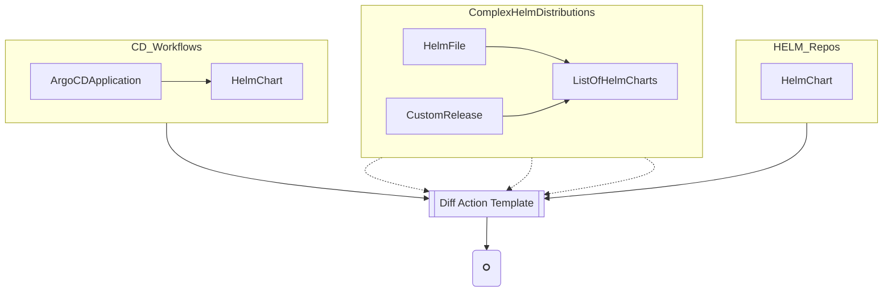

# action-helm-tools

GitHub Action for packaging, testing helm charts and publishing to Artifactory helm repo

_Note this action is written to specifically work with Helm repos in Artifactory_

## Inputs

### Required

`action` - `[package, test, publish]`

- `lint` - Runs helm linter along with dependency build.
- `diff` - Runs helm diff using templates along with dependency build.
- `package` - Involves helm client only and does dependency build, lint and package chart
- `publish-artifactory` - Uses helm artifactory plugin to uploads the chart
- `publish-chartmuseum` - Uses helm cm plugin to uploads the chart
- `publish-gar` - Uses helm (helm 3.8 or greater), to push on Google Artifactory Registry using OCI

## Required Environment variables

```yaml
# Environment variables if you want to use JFrog Artifactory
# ------------------------------------------------------------
CHART_DIR: manifests/charts/mycomponent # chart path
ARTIFACTORY_URL: # Artifactory registry https://<company>.jfrog.io/<company>
ARTIFACTORY_USERNAME: ${{ secrets.ARTIFACTORY_USERNAME }} # ARTIFACTORY_USERNAME (Artifactory username) must be set in GitHub Repo secrets
ARTIFACTORY_PASSWORD: ${{ secrets.ARTIFACTORY_PASSWORD }} # ARTIFACTORY_PASSWORD (Artifactory api key) must be set in GitHub Repo secrets

# Environment variables if you want to use Google Artifactory (GAR)
# --------------------------------------------------------------------
ACTION: "publish-gar"

# helm version should be greater or equal to v3.8.0
HELM_VERSION: "3.10.1"

# google artifactory url domain without protocol
GAR_URL: "us-docker.pkg.dev"

# path of the google project associated with GAR
# including the sub level (in the example gar-charts)
GCLOUD_PROJECT: "YOUR_PROJECT/gar-charts"

# path where the chart is defined in the repository
CHART_DIR: "manifests/charts/mycomponent"

# environment variable used to store the json representing
# the key-file for the service account to be used.
# This has to be the template string related to the
# secret stored in the github organization.
# This secret has to be activated for the specified
# github repository before it could be used.
GAR_JSON_KEY: "${{ secrets.GAR_DEV_RW_JSON_KEY }}"

# the prefix on GAR that you want to associate to the chart
# name, this is a way to group charts together.
# Examples values are:
#     "infra", "monitor", "secure", "sysdig", "tools", "ui"
#
# The chart will be stored on GAR following this scheme:
#   charts/{CHART_PREFIX}/{CHART_NAME}
#
# The chart prefix is used to distinguish from app container
# images with the same name pushed on GAR.
CHART_PREFIX: "YOURPREFIX"
UPSTREAM_BRANCH: "main"
CURRENT_BRANCH: "Add your current branch"
```

## Optional Environment variables

```yaml
HELM_VERSION: # Override helm version. Default "3.5.1"
KUBECTL_VERSION: # Override kubectl version. Default "1.21.0"
HELM_ARTIFACTORY_PLUGIN_VERSION: # Override helm artifactory plugin version. Default "v1.0.2"
HELM_CHARTMUSEUM_PLUGIN_VERSION: # Override helm chartmuseum plugin version. Default "0.10.3"
CHART_VERSION: # If defined, override version in Chart.yaml file. Default is unset
DEBUG: # If defined will set debug in shell script.
```


# Example workflow

Never use `main` branch in your github workflows!

```yaml
name: Helm lint, test, package and publish

on: pull_request

jobs:
  helm-suite:
    runs-on: ubuntu-latest
    steps:
    - uses: actions/checkout@v2

    # - name: myOtherJob1
    #   run:


      - name: "Helm publish"
        uses: rarchk/action-helm-tools@v1.1.0
        with:
          action: "package"
        env:
          CHART_DIR: resources/helm/sdcadminoper
          ARTIFACTORY_URL: https://artifactory.internal.sysdig.com:443/artifactory/helm-local/
          ARTIFACTORY_USERNAME: ${{ secrets.ARTIFACTORY_HELM_USERNAME }}
          ARTIFACTORY_PASSWORD: ${{ secrets.ARTIFACTORY_HELM_PASSWORD }}

      - name: "Helm publish artifactory"
        uses: rarchk/action-helm-tools@v1.1.0
        with:
          action: "publish-artifactory"
        env:
          CHART_DIR: resources/helm/sdcadminoper
          ARTIFACTORY_URL: https://artifactory.internal.sysdig.com:443/artifactory/helm-local/
          ARTIFACTORY_USERNAME: ${{ secrets.ARTIFACTORY_HELM_USERNAME }}
          ARTIFACTORY_PASSWORD: ${{ secrets.ARTIFACTORY_HELM_PASSWORD }}

```

## Another example for GAR

```yaml
name: Helm lint, test, package and publish
on: pull_request

jobs:
  helm-suite:
    runs-on: ubuntu-latest
    steps:
    - uses: actions/checkout@v2
      - name: "Helm Publish on GAR"
        uses: rarchk/action-helm-tools@v1.2.0
        with:
          action: "publish-gar"
        env:
          ACTION: "publish-gar"
          HELM_VERSION: "3.10.1"
          CHART_DIR: .
          # Please NOTE: gar-charts folder prefix is expected
          # you can avoid this check by setting
          # GCLOUD_PROJECT_CHECK="false"
          GCLOUD_PROJECT: "YOURPROJECTNAME/gar-charts"
          GAR_URL: "us-docker.pkg.dev"
          GAR_JSON_KEY: "${{ secrets.GAR_DEV_RW_JSON_KEY }}"
          CHART_PREFIX: "YOUR_PREFIX"
```
## Addon for chart-museum
```yaml
name: Helm lint, test, package and publish
on: pull_request

jobs:
  helm-suite:
    runs-on: ubuntu-latest
    steps:
    - uses: actions/checkout@v3
      - name: "Helm publish artifactory"
        uses: rarchk/action-helm-tools@v1.1.0
        with:
          action: "publish-chartmuseum"
        env:
          CHART_DIR: resources/helm/sdcadminoper
          ARTIFACTORY_URL: https://artifactory.internal.sysdig.com:443/artifactory/helm-local/
          ARTIFACTORY_USERNAME: ${{ secrets.ARTIFACTORY_HELM_USERNAME }}
          ARTIFACTORY_PASSWORD: ${{ secrets.ARTIFACTORY_HELM_PASSWORD }}
```

## Diff as a template
Diff can be used to compute differences between complex helm distributions


### Algorithm
1. We would need previous and next version
2. We would need access to remote chart repository
3. We can use this command to generate templates locally and remotely
4. We take following inputs
   1. previous version
   2. current version[optional] or can be generated locally

```bash
# local templating
helm template <chart_name>.tgz -f values.yaml

# remote templating
helm template <remote_repo>/chart_name --version 1.17.1 -f values.yaml

# search for all versions
helm search repo <remote_repo>/chart_name --versions
```
4. Diff it
